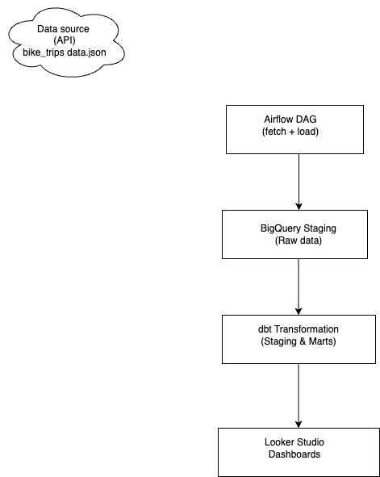

# Zoomcamp Data Engineering Project

Modern Data Pipeline for Bike Trips Data using:

- Apache Airflow (Orchestration)
- Google BigQuery (Data Warehouse)
- dbt (Transformations & Analytics)
- Secure Environment & Production-Ready Setup

---

---

## Architecture Overview



## Setup Instructions

### 1. Clone This Repository:

[git clone the repo](https://github.com/JudsonMorgan/Bike_trip_pipeline)
```bash
git clone https://github.com/JudsonMorgan/Bike_trip_pipeline.git


### 2. Create Virtual Environment

python3 -m venv venv
source venv/bin/activate
pip install -r requirements.txt

### 3. Environment variable

`GOOGLE_APPLICATION_CREDENTIALS=/Users/<your-username>/.gcp/gcp-key.json`

Load it:
```bash
export $(cat .env | xargs)
```

### 4. Running Airflow Locally

```bash
airflow db init
airflow scheduler
airflow webserver
```

Trigger DAG:
```bash
airflow dags trigger bike_data_pipeline
```
### 5. Running dbt locally

Navigate to your dbt project:
```bash
cd my_project/
dbt debug
dbt run
dbt test
dbt docs generate
dbt docs serve
```

## Live Dashboard

Visualize the NYC Bike Data with Looker Studio.

[View Looker Studio Dashboard](https://lookerstudio.google.com/u/0/reporting/185f828c-bb2e-4475-b2f7-ef8cfd994c4a/page/IAhGF/edit)

---

## Dashboard Features:
- Number of Cities
- Total Systems
- Trips per country
- City locations
- Filters for Country & City

## Dashboard Preview:


### Security Notes
- GCP Keys are NEVER committed to Git.

- Secrets managed via `.env`

- `.gitignore` protects sensitive files.

- Refer to `SECURITY_CHECKLIST.md` for best practices.


Author
Built with ❤️ by Jude — powered by Airflow, BigQuery, and dbt.